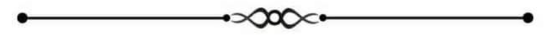

# Modul/dato/hold:

## Forberedelse
- [ ] Upload materialer, beskriv lektion og angiv referencer
- [ ] Beskriv lektion
- [ ] Angiv referencer

## Indledning
- [ ] Fravær
- [ ] Meddelelser
- [ ] Dagens program
- [ ] Hvad skal vi nå i dag?
- [ ] Repetition af sidste lektion
## Fagligt indhold
- [ ] Afklaring af forhåndsviden
```
.
.
.
.
.
.
```
## Aktiviteter 
- [ ] Besvarelse af udleverede spørgsmål
- [ ] Video
- [ ] Quiz
- [ ] Test
- [ ] Fremlæggelser
## Afslutning
- [ ] Fravær (muligvis) 
- [ ] Til næste gang

